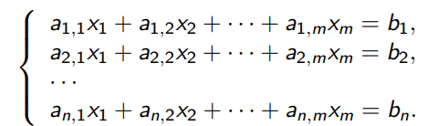

# 5. Однородные системы линейных уравнений
## Определения
Пусть K - поле, \\(a_{i,j} \in K\\) (где \\(i \in {1, \dotsc, n}, j \in {1, \dotsc, m}\\)),
\\(b_1, \dotsc, b_n \in K\\). Пусть \\(x_1, \dotsc, x_m\\) - неизвестные. Тогда
Система линейных уравнений (далее СЛУ) - это

СЛУ называется однородной (далее ОСЛУ), если \\(b_1 = \dotsc = b_n = 0\\).

## Элементраные преобразования СЛУ
1) Поменять местами два уравнения.
2) К одному уравнению прибавить другое, умноженное на \\(\lambda \in K\\)
3) Умножить уравнение на \\(\lambda \in K\\), отличное от 0
- Везде умножение уравнения на число происходит вместе с правой частью

## Определения
ОСЛУ приведена к ступенчатому виду, если каждое уравнение,
имеющее ненулевые коэффициенты, имеет вид
$$x_{s_i} + c_{i,s_i+1}x_{s_i+1} + \dotsc + c_{m,k}x_m = 0,$$
причем \\(s_1 < s_2 < \dotsc < s_k\\) (где k — наибольший номер
уравнения, имеющего ненулевые коэффициенты).

## Лемма 2
1) Элементарные преобразования всех трех типов обратимы, то есть имеют
обратные элементарные преобразования.
2) Элементарные преобразования не меняют решений СЛУ.
### Доказательство
1) - Элементарное преобразование типа (1) само себе обратно.
- Рассмотрим элементарное преобразование типа (2), пусть мы к i-му уравнению
прибавили j-е, умноженное на \\(\lambda\\)
- Тогда обратное преобразование - прибавить к i-му уравнению j-е уравнение,
умноженное на \\(- \lambda \\)
- Наконец, обратное преобразование к умножению уравнения на \\(\lambda \ne 0\\) -
умножить его же на \\(\lambda^{-1}\\)
2) - Очевидно, элементарное преобразование системы оставляет все ее решения (все уравнения останутся верными)
- Так как такое преобразование обратимо, добавиться новые решения не могут - иначе
проведем обратное преобразование, и все новые решения сохранятся.

## Лемма 3
ОСЛУ можно привести элементарными преобразованиями к
ступенчатому виду.
### Доказательство
- Индукция по количеству неизвестных.
База для одного неизвестного очевидна — наша система
имеет вид \\(ax_1 = 0\\).
- Если \\(a \ne 0\\), то на a можно поделить и получить \\(x_1 = 0\\). Если
же a = 0, система уже имеет ступенчатый вид
Переход \\
- Если все коэффициенты при \\(x_1\\) равны 0, то достаточно
  привести к ступенчатому виду систему без \\(x_1\\), что можно
  сделать по индукционному предположению.
- Если не все коэффициенты \\(a_{i,1}\\) равны 0, то переставим
  уравнения (с помощью элементарных преобразований
  типа (1)) так, чтобы \\(a_{1,1} \ne 0\\), после чего поделим первое
  уравнение на \\(a_{1,1}\\) — оно примет нужный нам вид
  \\(x_1 + c_{1,2}x_2 + \dotsc + c_{1,m}x_m = 0\\).
- Теперь для всех \\(k \in {2, \dotsc, n} \\) } вычтем из k уравнения
  новое первое уравнение, умноженное на \\(a_{k,1}\\) — во всех
  уравнениях, кроме первого, исчезнет переменная \\(x_1\\).
- Далее останется применить к системе из всех
  уравнений, кроме первого, индукционное предположение.

## Лемма 4
ОСЛУ, в которой неизвестных больше, чем уравнений,
имеет нетривиальное решение (не все \\(x_i\\) равны 0).
### Доказательство
- Приведем систему к ступенчатому
  виду.
- Будем считать, что обозначения как в определении.
  Пусть осталось k уравнений с ненулевыми
  коэффициентами. Тогда \\(s_1 < s_2 < \dotsc < s_k\\) — не более
  чем n < m номеров переменных.
- Остались переменные с номерами не из \\({s_1, \dotsc ,s_k}\\).
  Положим все их равными 1.
- После чего последовательно вычислим: сначала \\(x_{s_k}\\),
  потом \\(x_{s_{k−1}}\\), и так далее, \\(x_{s_1}\\).
- Переменную \\(x_{s_i}\\) мы вычисляем из i уравнения:
  $$ x_{s_i} = −(c_{i,s_i+1}x_{s_i+1} + \dotsc + c_{i,m}x_m),$$
  все значения в правой части уже известны.
