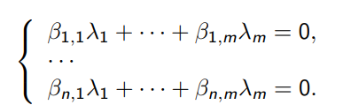

# 6. Лемма о линейной зависимости линейных комбинаций

## Лемма 5
Пусть V - линейное просранство над полем K, n < m,
\\(a_1, \dotsc, a_n \in V\\) и \\(y_1, \dotsc, y_m \in Lin(a_1, \dotsc, a_n)\\) Тогда
\\(y_1, \dotsc, y_m\\) ЛЗ
### Доказательство
- Пусть \\(y_1 = \beta_{1,1}a_1 + \dotsc + \beta_{n,1}a_n, \dotsc,\\)
\\(y_m = \beta_{1,m}a_1 + \dotsc + \beta_{n,m}a_n\\)
- Мы хотим найти такие \\(\lambda_1, \dotsc, \lambda_m \in K\\) (не все равные 0),
что \\(\lambda_1y_1 + \dotsc + \lambda_m y_m = 0\\). Это означает, что \\
\\(0 = \lambda_1(\beta_{1,1}a_1 + \dotsc + \beta_{n,1}a_n) + \dotsc + \lambda_m(\beta_{1,m}a_1 + \dotsc + \beta_{n,m}a_n) =\\) \\((\beta_{1,1)\lambda_1 + \dotsc + \beta_{1,m}\lambda_m)a_1 + \dotsc + (\beta_{n,1}\lambda_1 + \dotsc + \beta_{n,m}\lambda_m)a_n\\). \\
- Для равенства нулю этого выражения достаточно, чтобы были равны 0 коэффициенты при
\\(a_1, \dotsc, a_n\\). Это дает нам ОСЛУ (относительно неизвестных \\(\lambda_1, \dotsc, \lambda_m \\)):  

- В этом ОСЛУ неизвестных больше, чем уравнений. Значит, она имеет нетривиальное решение -
соответствующие \\(\lambda_1, \dotsc, \lambda_m\\) дают линейную зависимость \\(y_1, \dotsc, y_m\\)

