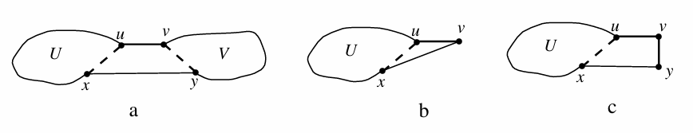

# Гамильтонов цикл в кубе связного графа

## Определение
Для графа *G* и натурального числа *d* обозначим через $G^d$ граф на вершинах из *V(G)*, в котором вершины *x* и *y* смежны тогда и только тогда, когда $dist_G(x, y) \le d$

## Теорема
Для любого связного графа *G* с $v(G) \ge 3$ и ребра $e \in E(G)$ в графе $G^3$ существует ГЦ, содержащий ребро *e*.
### Доказательство 
* Достаточно доказать теорему для случая, когда *G* - дерево (иначе выделим остовное дерево, содержащее ребро *e*).
* Мы докажем утверждение индукцией по количеству вершин. База для дерева на трех или четырех вершинах очевидна (тогда $G^3$ - это полный граф).
* Пусть для меньших чем *G* всех деревьев теорема доказана.  
* Пусть $e = uv$, тогда в графе $G - uv$ две компоненты связности $U \ni u$ и $V \ni v$. Пусть $G_u = G(U)$ и $G_v = G(V)$. НУО $|U| \ge 3$. Тогда в $G_u^3$ есть ГЦ, содержащий инцидентное *u* ребро $ux \in E(G)$.
* Если $|V| \ge 3$, то аналогично мы построим ГЦ в графе $G_v^3$, содержащий инцидентное вершине *v* ребро $vy \in E(G)$ и соединим эти два цикла в один, заменив ребра *ux* и *vy* на *uv* и *xy*, см. рисунок а (из $dist_G(x, y) = 3$ следует $xy \in E(G^3)$).

Остаются очевидные случаи, когда $|V| < 3$. При $V = \{v\}$ мы заменим в ГЦ графа $G_u^3$ ребро *ux* на *uv* и *vx* (рис. b). При $V = \{v, y\}$, очевидно, $vy \in E(G)$ и мы заменим в ГЦ графа $G_u^3$ ребро *ux* на *uv*, *vy* и *yx* (рис. c).