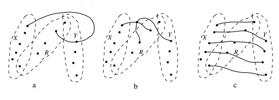

# Билет 7

## Теорема Менгера в форме Гёринга (для двух множеств).

### **Теорема 5**

_(F. Göring, 2000.)_ Пусть X, Y ⊂ V(G), $κ_G$ (X, Y ) ≥ k, |X| ≥ k, |Y | ≥ k. Тогда в графе G существуют k
непересекающихся XY -пyтей.

#### **Доказательство**

+ Индукция по количеству вершин в графе. Доказывая утверждение для графа G и пары множеств X, Y , мы будем считать
  утверждение уже доказанным для всех меньших графов.
  **База:** V(G) = X ∪ Y
+ Пусть W = X ∩ Y, X′ = X \ W и Y′ = Y \ W, а H — двудольный подграф G(X′ ∪ Y′), содержащий все ребра G между X′ и Y′
+ Нам достаточно доказать, что H содержит совершенное паросочетание (тогда ребра этого паросочетания и вершины из W как
  раз будут k искомыми путями).
+ Пусть это не так, рассмотрим максимальное паросочетание M в H, пусть |M| = m < |X′|.
+ Тогда по теореме Кёнига (2.5) в H существует вершинное покрытие B из m вершин.
+ Это означает, что множество R = B ∪ W отделяет X от Y, причем |R| < |X| = k, противоречие.
  **Переход:** V(G) \ (X ∪ Y ) &ne; ∅.
    1. **(Случай первый) cуществует множество R из k вершин, разделяющее X и Y**
        + Никакой XR-путь не содержит вершины из Y \ R (иначе существовал бы XY -путь, не содержащий ни одной вершины
          множества R, см. рис a).
        + Следовательно, любое множество S, отделяющее X от R в графе $G_x$ = G − (Y \ R), отделяет X от R и в графе G.
          Но тогда S отделяет X от Y в графе G, cледовательно, |S| ≥ k.
          
        + По индукционному предположению существует k непересекающихся XR-путей в графе Gx, а следовательно, и в графе
          G.
        + Аналогично, существует k непересекающихся RY -путей в графе G.
        + Никакой XR-путь не пересекает никакой RY -путь
          (иначе существовал бы XY -путь, не содержащий ни одной вершины множества R, см. рис. b).
        + Так как |R| = k, то мы можем состыковать XR-пути и RY -пути по вершинам множества R, получив k
          непересекающихся XY -путей (см. рис. c)
    2. **(Случай второй) Нет множества из k вершин, разделяющего X и Y**
        + Пусть a ∈ V(G) \ (X ∪ Y ) и G′ = G − a.
        + Тогда любое множество R′ , отделяющее X от Y в G′ имеет хотя бы k вершин (так как R′ ∪ {a} отделяет X от Y в
          G).
        + По индукционному предположению в графе G′ (подграфе G) существуют k искомых XY -путей.
