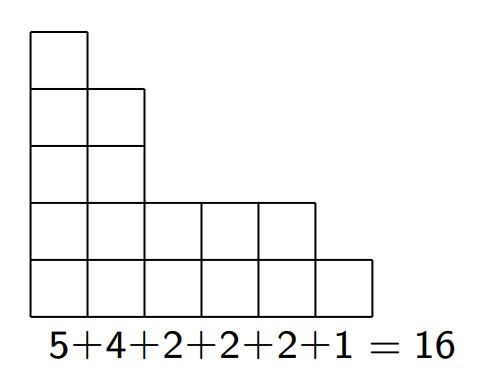

# Билет 3

## Неупорядоченные разбиения. Связь с диаграммами Юнга. Запись в виде решений специального уравнения.

### **Определение**

+ $p_m$(n) — количество неупорядоченных разбиений числа n на m слагаемых;
+ p(n) — количество неупорядоченных разбиений числа n.

### **Стандартная форма записи**

Слагаемые неупорядоченного разбиения обычно записывают в невозрастающем порядке:
n = $x_1$ +...+ $x_m$, где $x_1$ ≥ $x_2$ ≥...≥ $x_m$ > 0.

### **Диаграммы Юнга**

+ Каждому разбиению числа n соответствует следующая диаграмма из n клеток.
+ Столбцы диаграммы соответствуют слагаемым. Количество столбцов равно m.
  

### **Теорема 3**

1. Количество решений уравнения $t_1$ + 2* $t_2$ + 3* $t_3$ + ... + n* $t_n$ = n в целых неотрицательных числах равно p(
   n).
2. Количество решений [уравнения (1)](#уравнение-1), удовлетворяющих условию $t_1$ +...+ $t_n$ = m, равно $p_m$(n).

#### **Доказательство**

+ Пусть n = $x_1$ +...+ $x_m$ — разбиение числа n.
+ Обозначим через $t_k$ количество слагаемых в этом разбиении, равных k.
+ Получим решение [уравнения (1)](#уравнение-1).
+ Аналогично, каждому решению ( $t_1$ , $t_2$ ,..., $t_n$ ) [уравнения (1)](#уравнение-1)
  соответствует разбиение n, в котором ровно $t_k$ слагаемых, равных k.
+ При этом, количество слагаемых в разбиении будет равно $t_1$ +... + $t_n$.
